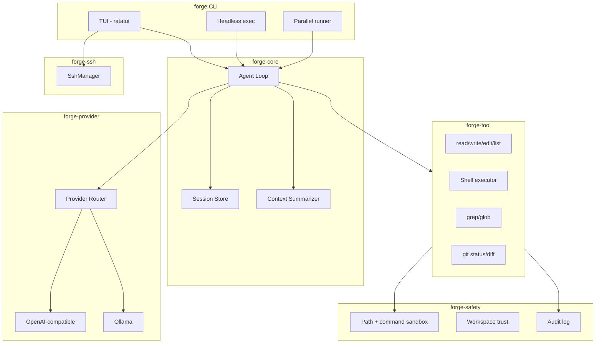

# Forge

**Forge** is a local-first, production-oriented terminal coding agent written in Rust. It combines a streaming LLM agent loop, safe file/shell tools, parallel sub-agents, SSH remote execution, and a ratatui TUI — all driven by TOML configuration.

## Architecture



### Crate layout

| Crate | Responsibility |
|-------|----------------|
| `forge` | CLI entrypoint (`forge`, `forge exec`, etc.) |
| `forge-config` | TOML configuration loading/saving |
| `forge-core` | Agent loop, sessions, context management |
| `forge-provider` | LLM providers + failover router |
| `forge-tool` | Tool registry and implementations |
| `forge-safety` | Sandbox, workspace trust, audit logging |
| `forge-parallel` | Parallel sub-agent execution |
| `forge-ssh` | SSH host management and remote exec |
| `forge-tui` | Interactive terminal UI + slash commands |

### Agent loop

1. User message appended to session
2. Context summarized if over threshold
3. LLM called with tool definitions (streaming)
4. Tool calls executed concurrently per turn
5. Results fed back until no more tool calls or max turns
6. Session auto-saved to `~/.forge/sessions/`

## Installation

**Requirements:** Rust 1.75+, `bash`, `git` (optional), `ssh` (for remote features)

```bash
# Clone and build
git clone <repo-url> forge
cd forge
cargo build --release

# Install binary
cargo install --path crates/forge

# Initialize default config
forge init
```

Config is written to `~/.forge/config.toml`. See `config.example.toml` for all options.

## Quick start

```bash
# Trust workspace and start interactive TUI
forge --trust

# Headless single task
forge exec "list all Rust files and summarize the project structure"

# Override model
forge --model gpt-4o --trust

# Resume a session
forge chat --session <session-id>
```

### Provider setup

**Ollama (default):**
```bash
ollama pull llama3.2
forge --trust
```

**OpenAI / Azure / Groq / Together / etc.:**
Edit `~/.forge/config.toml`:
```toml
[[providers]]
name = "openai"
kind = "openai_compatible"
base_url = "https://api.openai.com"
api_key_env = "OPENAI_API_KEY"
models = ["gpt-4o"]
enabled = true
priority = 5

[agent]
model = "gpt-4o"
```

Set `OPENAI_API_KEY` in your environment. Providers are tried in priority order with automatic failover.

## Slash commands (TUI)

| Command | Description |
|---------|-------------|
| `/help` | Show command help |
| `/model [name]` | Show or set model |
| `/tools` | List available tools |
| `/clear` | Clear output pane |
| `/new` | Start a fresh session |
| `/compact` | Drop oldest messages when the session is long |
| `/todo` | Toggle the todo panel (`/todo add <task>`, `/todo clear`) |
| `/resume` | Resume last session |
| `/ssh list` | List SSH hosts |
| `/ssh connect <alias>` | Connect to host |
| `/ssh exec <alias> <cmd>` | Run remote command |
| `/parallel task1; task2` | Queue parallel tasks |
| `/debug` | Debug mode info |
| `/skills` | List loaded skills |
| `/toggle-mouse` | Enable/disable mouse capture + text selection |

## TUI features

- **Streaming transcript** with word-wrap, mouse wheel scrolling, and click-to-expand/collapse tool cards (long outputs are auto-folded).
- **Text selection & copy:** drag with the mouse to select, `Ctrl+Shift+C` / `Ctrl+C` copies; double/triple click selects word/line. `Ctrl+X` cuts the input selection, `Ctrl+V` pastes.
- **Multiline input:** `Shift+Enter` inserts a newline, `↑/↓` recall history, `Ctrl+A` selects all in the input.
- **Tool approvals:** destructive tools ask before running — the input area becomes a `y`/`n` prompt (`Esc` denies, `Ctrl+C` cancels the turn).
- **Reasoning display:** providers that stream `reasoning_content` render a timed `💭 Thought: 14.3s` block with the model's reasoning, collapsed by default.
- **Options picker:** when the agent calls `ask_options`, a numbered picker appears (`↑/↓` + `Enter`, or click); typing a printable character switches to a custom answer, `Esc` dismisses.
- **Todo side panel:** live task list on the right. `Ctrl+T` opens/focuses/closes it, `Space` toggles an item, `d` deletes, `[`/`]` resize while focused, mouse clicks toggle. Todos persist with the session and sync with the agent's `todo` tool.
- **Rich status bar:** spinner, live token count + context usage %, and permission mode (`ask`/`allow`).
- **Focus management:** the todo panel can hold keyboard focus (`Tab`/`Esc` returns to input); the input stays reachable at all times.

## CLI reference

```bash
forge                          # Interactive TUI
forge exec "task"              # Headless execution
forge exec "task" --format json
forge parallel --tasks "fix tests; update docs"
forge sessions list
forge sessions delete <id>
forge ssh list
forge ssh connect prod
forge ssh exec prod "uptime"
forge debug analyze error.log
forge debug start -- ./myapp --arg
forge init                     # Create ~/.forge/config.toml
```

### Flags

| Flag | Description |
|------|-------------|
| `-c, --config <path>` | Config file path |
| `-w, --workspace <dir>` | Workspace root (default: `.`) |
| `-m, --model <name>` | Model override |
| `--trust` | Trust workspace without prompt |
| `--full-auto` | Skip destructive action confirmations |

## Tools

| Tool | Description |
|------|-------------|
| `read_file` | Read file with optional line offset/limit |
| `write_file` | Write/create files |
| `edit_file` | Surgical search-and-replace |
| `list_dir` | List directory (optional recursive) |
| `grep` | Regex search across files |
| `glob` | Find files by glob pattern |
| `project_index` | Build project structure + symbol index |
| `search_codebase` | Relevance search across indexed project |
| `shell` | Execute sandboxed shell commands |
| `git_status` | Git working tree status |
| `git_diff` | Git diff (optional path, staged) |
| `git_log` | Recent commit history |
| `git_commit` | Stage all and commit with message |
| `code_outline` | Extract functions/structs/classes from source files |
| `read_skill` | Load a skill workflow by name |
| `todo` | Add/complete/reopen/remove tasks (live session todo list) |
| `ask_options` | Ask the user to pick from a list of options (TUI picker) |
| `remote_exec` | Run command on SSH host (when configured) |
| `remote_read_file` | Read file from SSH host |
| `remote_list_dir` | List directory on SSH host |

## MCP integration

Configure MCP servers in `~/.forge/config.toml`. Tools are auto-registered as `mcp_<server>_<tool>`:

```toml
[[mcp.servers]]
name = "filesystem"
command = "npx"
args = ["-y", "@modelcontextprotocol/server-filesystem", "/path/to/workspace"]
```

## Safety model

- **Workspace trust:** Untrusted workspaces are blocked until `--trust` or explicit trust
- **Path sandbox:** File operations restricted to workspace by default
- **Command allow-list:** Only approved commands can run via `shell` tool
- **Destructive confirmation:** `rm`, `git reset --hard`, etc. require confirmation (unless `--full-auto`)
- **Audit log:** All tool calls logged to `~/.forge/audit.log`

## Parallel execution

```bash
forge parallel --tasks "add unit tests for auth; document API endpoints; fix clippy warnings"
```

Each task runs in an isolated agent session concurrently. In git repos, tasks automatically use **git worktrees** for safe parallel edits.

## SSH

Configure hosts in `~/.forge/config.toml`:

```toml
[[ssh.hosts]]
alias = "prod"
host = "10.0.0.1"
port = 22
user = "deploy"
identity_file = "~/.ssh/id_ed25519"
```

```bash
forge ssh connect prod
forge ssh exec prod "journalctl -u myapp -n 50"
```

## Debugging

```bash
# Analyze error logs
forge debug analyze /var/log/app.log

# Launch interactive debugger
forge debug start -- ./target/debug/myapp
forge debug start --debugger gdb -- ./myapp
```

## Configuration

Full example: [`config.example.toml`](config.example.toml)

Key sections:
- `[agent]` — model, temperature, max tokens, system prompt
- `[[providers]]` — LLM provider definitions with failover priority
- `[safety]` — sandbox rules, allow-list, audit settings
- `[tools]` — enable/disable tool groups
- `[session]` — persistence and context window settings
- `[[ssh.hosts]]` — remote machine definitions
- `[[mcp.servers]]` — MCP server stubs (extensibility hook)

## Extensibility

- **Skills/plugins:** Load from `skills/` or `~/.forge/skills/` — each directory with a `SKILL.md` file
- **MCP client:** `[[mcp.servers]]` config section — tools auto-registered as `mcp_<server>_<tool>`
- **Hooks:** Pre/post tool and turn lifecycle via `HookRegistry` (see `docs/ARCHITECTURE.md`)
- **tree-sitter:** Code intelligence layer upgrade (planned)
- **Worktree isolation:** Parallel agents in git worktrees (`forge-parallel`)

See [docs/ARCHITECTURE.md](docs/ARCHITECTURE.md) for full implementation status and roadmap.

## Development

```bash
cargo build
cargo test
RUST_LOG=forge=debug forge --trust exec "hello"
```

## License

MIT
