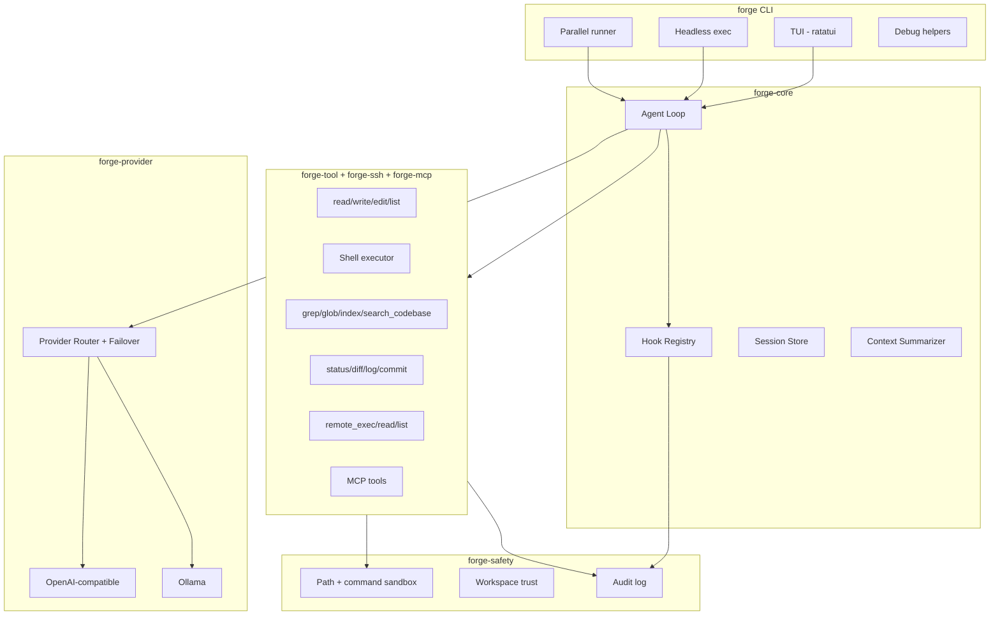

# Forge Architecture & Implementation Status

This document maps the original Forge specification to what is implemented in this repository, what was recently added, and what remains on the roadmap.

## High-Level Architecture



## Crate Layout

| Crate | Responsibility |
|-------|----------------|
| `forge` | CLI entrypoint, debug commands, hook wiring |
| `forge-config` | TOML configuration loading/saving |
| `forge-core` | Agent loop, sessions, hooks, context management |
| `forge-provider` | LLM providers + failover router |
| `forge-tool` | Tool registry and local implementations |
| `forge-safety` | Sandbox, workspace trust, audit logging |
| `forge-parallel` | Parallel sub-agent execution + git worktrees |
| `forge-ssh` | SSH host management, remote tools |
| `forge-mcp` | MCP JSON-RPC client |
| `forge-tui` | Interactive terminal UI + slash commands |

## Requirement Checklist

### 1. LLM Provider Support

| Feature | Status | Notes |
|---------|--------|-------|
| OpenAI-compatible API | ✅ Done | `forge-provider/openai.rs` |
| Ollama | ✅ Done | `forge-provider/ollama.rs` |
| Streaming | ✅ Done | SSE via `eventsource-stream` |
| Tool/function calling | ✅ Done | Full round-trip in agent loop |
| Automatic failover | ✅ Done | `ProviderRouter` by priority |
| TOML config | ✅ Done | `config.example.toml` |
| Vision / image input | ⬜ Roadmap | Not yet — message schema is text-only |
| Embeddings API | ⬜ Roadmap | — |

### 2. Interactive Terminal Experience

| Feature | Status | Notes |
|---------|--------|-------|
| ratatui TUI | ✅ Done | `forge-tui` |
| Slash commands | ✅ Done | `/help`, `/model`, `/tools`, `/new`, `/compact`, `/todo`, `/ssh`, `/parallel`, `/debug`, `/clear`, `/resume`, `/skills`, `/toggle-mouse` |
| Session history + resume | ✅ Done | `~/.forge/sessions/` |
| Streaming output | ✅ Done | Real-time content + tool feedback |
| Context summarization | ✅ Done | Token threshold trigger |
| Tool approvals | ✅ Done | `ApprovalGate` y/n prompt for destructive tools |
| Reasoning/thought blocks | ✅ Done | `reasoning_content` -> `Thinking*` events -> timed `💭 Thought` blocks |
| Options picker | ✅ Done | `ask_options` tool -> `OptionsRequest` -> numbered picker (↑/↓+Enter+mouse, custom answer) |
| Todo side panel | ✅ Done | `todo` tool + `TodoUpdate` snapshots; Ctrl+T focus, Space toggle, `[`/`]` resize, persisted in session |
| Rich status bar | ✅ Done | spinner, tokens + context %, permission mode |
| Text selection/copy | ✅ Done | mouse drag, double/triple click, Ctrl+Shift+C, Ctrl+X/V |
| Multi-pane layout | ✅ Done | output + resizable side panel + input + status bar |

### 3. Coding Capabilities

| Feature | Status | Notes |
|---------|--------|-------|
| File tools | ✅ Done | read, write, edit, list |
| Shell execution | ✅ Done | Sandboxed + timeout |
| ripgrep search | ✅ Done | `grep` tool |
| Glob search | ✅ Done | `glob` tool |
| Project indexing | ✅ Done | `project_index` tool |
| Semantic-style search | ✅ Done | `search_codebase` (symbol + content scoring) |
| Code outline | ✅ Done | Regex-based `code_outline` |
| tree-sitter | ⬜ Roadmap | Planned upgrade for `code_outline` |
| Git status/diff | ✅ Done | |
| Git log/commit | ✅ Done | Added `git_log`, `git_commit` |
| PR review workflow | ⚠️ Partial | Via `skills/code-review/SKILL.md` |

### 4. Parallel Execution

| Feature | Status | Notes |
|---------|--------|-------|
| Parallel sub-agents | ✅ Done | `forge parallel`, `/parallel` |
| Task decomposition | ✅ Done | `decompose_and_run()` |
| Concurrent tool calls | ✅ Done | `tokio::spawn` per tool in agent turn |
| Git worktree isolation | ✅ Done | `forge-parallel/worktree.rs` |
| Progress tracking | ✅ Done | `ParallelTask` status |

### 5. SSH & Remote

| Feature | Status | Notes |
|---------|--------|-------|
| Host config persistence | ✅ Done | TOML `[[ssh.hosts]]` |
| Key-based auth | ✅ Done | `identity_file` + ssh CLI |
| Password auth | ⚠️ Partial | `password_env` in config, not wired to exec |
| Multiple sessions | ✅ Done | Session map in `SshManager` |
| Remote exec tool | ✅ Done | `remote_exec` |
| Remote file read | ✅ Done | `remote_read_file` |
| Remote list dir | ✅ Done | `remote_list_dir` |
| Port forwarding | ⚠️ Partial | `port_forward_command()` helper only |
| Native russh | ⬜ Roadmap | russh dep present; exec uses ssh CLI |

### 6. Debugging

| Feature | Status | Notes |
|---------|--------|-------|
| Log analysis | ✅ Done | `forge debug analyze` |
| Debugger spawn | ✅ Done | `forge debug start` (lldb/gdb) |
| Breakpoints/step/inspect | ⬜ Roadmap | Requires debugger protocol integration |
| Remote debug over SSH | ⬜ Roadmap | — |

### 7. Safety & Security

| Feature | Status | Notes |
|---------|--------|-------|
| Workspace trust | ✅ Done | `--trust` flag |
| Path sandbox | ✅ Done | Workspace boundary enforcement |
| Command allow-list | ✅ Done | Configurable in TOML |
| Audit logging | ✅ Done | `~/.forge/audit.log` |
| Destructive confirmation | ✅ Done | `--full-auto` to bypass |
| Hook-based audit | ✅ Done | Post-tool hook in agent |

### 8. Extensibility

| Feature | Status | Notes |
|---------|--------|-------|
| Skills | ✅ Done | `SKILL.md` in `skills/` or `~/.forge/skills/` |
| MCP client | ✅ Done | JSON-RPC over stdio |
| Custom tools | ✅ Done | `Tool` trait + `ToolRegistry::register` |
| Lifecycle hooks | ✅ Done | `HookRegistry` pre/post tool, turn events |

### 9. Architecture Goals

| Feature | Status | Notes |
|---------|--------|-------|
| Modular crates | ✅ Done | 10-crate workspace |
| Config-driven | ✅ Done | TOML |
| Headless mode | ✅ Done | `forge exec` |
| Session persistence | ✅ Done | JSON sessions |
| Observability | ⚠️ Partial | `tracing` + token usage events; no Prometheus yet |

## Agent Loop (current)

1. User message appended; context summarized if over threshold
2. LLM called with tool definitions (streaming)
3. Reasoning stream (`reasoning_content`) emitted as `Thinking`/`ThinkingDelta`/`ThinkingEnd` events
4. **All tool calls in a turn execute concurrently** via `tokio::spawn`
5. `todo` and `ask_options` calls are intercepted and handled interactively: todo ops mutate the session and emit `TodoUpdate` snapshots; `ask_options` emits `OptionsRequest` and blocks on the TUI's options channel
6. Pre/post hooks fire around each tool execution
7. Tool results fed back; loop until no tool calls or max turns
8. Session auto-saved

## Interactivity model

The agent loop never blocks on the TTY. Interactive gates are injected per turn via `Interactivity`:

- `ApprovalGate` — carries an `UnboundedReceiver<bool>`; `ask()` emits `ApprovalRequest` and waits for y/n.
- `OptionsGate` — carries an `UnboundedReceiver<String>`; `ask()` emits `OptionsRequest` and waits for a choice (or `None` when dismissed).
- Headless callers (`forge exec`, `forge-parallel`) pass `Interactivity::none()`; both gates immediately return and the tools fall back to non-blocking messages.

Events (`forge-core/events.rs`) are serializable and drive both the TUI and headless consumers.

## Step-by-Step Implementation Plan (remaining)

### Phase 1 — Core hardening (near-term)
- [ ] Wire `password_env` for SSH password authentication
- [ ] Add integration tests for agent loop + tools (mock provider)
- [ ] TUI scrollback for long outputs

### Phase 2 — Code intelligence
- [ ] tree-sitter integration for `code_outline`
- [ ] Optional embedding-based `search_codebase` via provider API

### Phase 3 — Advanced debugging
- [ ] lldb-mi / DAP protocol wrapper for step/breakpoint/inspect
- [ ] Remote debug tunnel over SSH

### Phase 4 — Production ops
- [ ] Prometheus metrics endpoint
- [ ] Vision message support for multimodal models
- [ ] Plugin hot-reload

## Quick Start

```bash
cargo build --release
forge init
forge --trust                          # Interactive TUI
forge exec "summarize this project"    # Headless
forge parallel --tasks "task1; task2"  # Parallel agents
```

See [README.md](README.md) for full usage documentation.
